 <h1>Der Spendenschädel</h1>

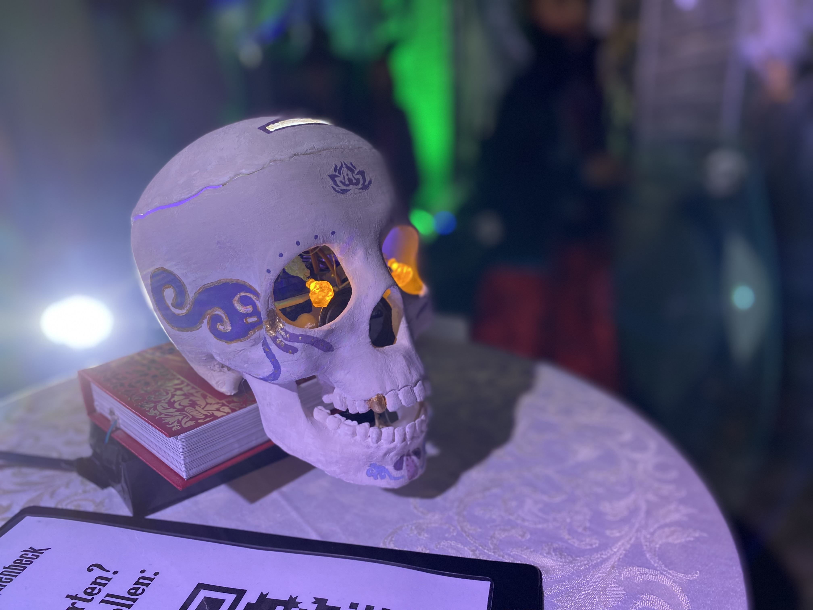

<h1 id="oben"<bold>Navigation</bold></h1>
  
  1.  Das Projekt <br>
    I   <a href="#Ideenfindung">Ideenfindung</a><br>
    II  <a href="#Konzeption">Konzeption</a><br>
    III <a href="#Wahl der Hardware">Wahl der Hardware</a><br>
    IV  <a href="#Wahl der Software">Wahl der Software</a><br>
 2. Entwicklung<br>
    I   <a href="#Stundenprotokoll">Stundenprotokoll</a><br>
    II  <a href="#Code">Code</a><br>
    III <a href="#Bau- und Schaltplan">Bau- und Schaltplan</a><br>
    IV  <a href="#Multimediaproduktion">Multimediaproduktion</a><br>
 3. Evaluation<br>
    I   <a href="#Besucherreaktionen an Halloween">Besucherreaktionen an Halloween</a><br>
    II  <a href="#Technische Evaluation">Technische Evaluation</a><br>
    III <a href="#Persönliches Wachstum">Persönliches Wachstum</a><br>
 4. <a href="#quellen">Quellen und Eigenständigkeitserklärung</a>
  
<h1> 
<bold>Das Projekt</bold>
  
  <h2 id="Ideenfindung">Ideenfindung</h2><br>
  
Die Gestalter des Projektes, Alicia Gärtner und Rosalie Muchow, sind beide Teammitglieder des <strong>Halloweenhaus Schmalenbeck</strong>.<br>
  In dem seit 10 Jahren stetig wachsenden, interdisziplinären & jungen Team bekommen beide einen vielfältigen Eindruck in den Themenbereichen Show- und Bühnendesign, Veranstaltungstechnik oder dem Bau von Audio Animatronics. Die Begeisterung für Audio Animatronics wurde neben dem Halloweenhaus auch bei gemeinsamen Freizeitparkbesuchen geformt. Besonders die unpräzisen 
Bewegungen günstiger Animatronics gefällt dem Duo gar nicht.<br>
  Schnell wurde den Freunden klar, dass dieses Projekt eine hervorragende Möglichkeit ist, das Halloweenhaus mit einer technischen Neuheit zu bereichern.<br>
Bei einem kurzen Brainstorming Prozess erinnert sich das Team an den seit 2016 genutzten Spendenschädel, welchen Rosalie als unästhetisch und unauffällig empfindet. Zusätzlich ist dieser durch das Loch am Boden sehr unsicher gegen Diebstahl und für die steigenden Spendengelder zu klein. An diesem Punkt beschließt das Team, eine neue Version des Schädels zu bauen.<br> 
Inspiriert von den Mülleimern im niederländischen Freizeitpark Efteling, welche „Papier hier“ rufen (https://www.youtube.com/watch?v=u1g2USFuu3Y) und sich nach dem erfolgreichen Einwurf bedanken, wird ein Konzept entworfen, welches alle Probleme des alten Schädels eliminieren soll. 


  <h2 id="Konzeption">Konzeption</h2><br>
  
Der Spendenschädel ist eine <strong>interaktive Spendenbox in Form eines Schädels</strong>.<br>
 Dieser hat eine <strong>eigene Persönlichkeit</strong> und wirkt durch seine sich <strong>bewegenden Augen</strong> lebendig. Karl-Leopold fragt mit seinem <strong>beweglichen Kiefer</strong> in zufälligen Abständen nach Spenden oder erzählt Teile seiner Lebensgeschichte.<br> 
  
Wenn ein Besucher Geld durch einen Münzschlitz im Kopf wirft, <strong>bedankt</strong> sich der Schädel mit einem zufälligen Spruch, sodass der Mensch animiert wird, mehr Geld zu spenden. Damit der Schädel nicht übersehen wird, ist er <strong>ansprechend gestaltet</strong> und mit <strong>LEDs</strong> in Augen Kopf ausgestattet. Das Konstrukt aus Schädel, dem darunterstellenden Buch und Netzteil ist per Kabel mit einer Stromquelle verbunden. In Kombination mit einem Gesamtgewicht von über 1,8kg und einer mit Magneten und Kabel gesichteten Schädeldecke ist die <strong>Gefahr von einem Diebstahl deutlich geringer</strong> als in den vergangenen Jahren. <br>
  
<details>
  <summary>Persönlichkeit des Schädels</summary>
  Der fiktive Charakter des Schädels ist der von Héctor Rivera (Deuteragonist aus Pixar’s Coco) inspirierte Künstler <strong>Karl-Leopold</strong>.<br>
  Er lebte zwischen 1813 und 1834, bis er tragisch durch den Gebrauch von giftiger Farbe verstarb.<br> 
  Um Geld zu sparen, nutzt er sein Gesicht als Leinwand, auch viele Jahre nach seinem Tod. Wie er zu seinem Status als lebendiger Schädel kam, weiß er selber nicht, doch durch seine sarkastische Art wird er von den Menschen an Halloween akzeptiert.
</details>
  
<details>
  <summary>Das Halloweenhaus Schmalenbeck</summary>
  Das junge Team des Halloweenhaus Schmalenbeck lässt <strong>Dekorationen, Musik, Lichtdesign, Informatik, Schauspiel, Robotik, Film</strong> und viele weitere Fähigkeiten zusammentreffen, um jährlich an Halloween eine etwa <strong>5-minütige, interaktive Show</strong> zu gestalten. Der Fokus der Show ist ein <strong>familienfreundlicher Wow-Effekt</strong>, welcher unteranderem durch <br>selbstkomponierte Musik</strong>, eigens erbauten <strong>Animatronics</strong>, <strong>aufwendigen Lichtinstallationen, Projektionen und Soundsystemen, Kurzfilmen</strong> und einem <strong>kostenlosen Eintritt</strong> erreicht wird.<br>
  Seit 2012 wachsen Team und Besucherzahlen stetig, sodass an Halloween <strong>über 500 Menschen</strong> das sonst unscheinbare Haus im Dorf besuchen. 
2022 gelang dem Haus der Durchbruch im <strong>deutschen Fernsehen</strong>. Mit einem <strong>Fernsehbeitrag von SAT.1</strong>, ständig wiederholten <strong>Radiointerviews bei NDR2</strong>, dem <strong>Hamburger Abendblatt</strong>, der <strong>SHZ</strong>, <strong>unzähligen Websites</strong>, mehreren Beiträgen im <strong>NDR</strong> und darunter sogar einer <strong>Liveschalte</strong> wurde das Haus auch <strong>über den norddeutschen Grenzen bekannt</strong>.
</details>

  <details>
  <summary>Gamification</summary>
  Gamification, also Spielifikation, beschreibt die <strong>Übertragung spieltypischer Elemente in spielfremde Zusammenhänge</strong>.<br>
  Das Ziel ist eine <strong>Motivationssteigerung des Nutzers</strong>. Genau das Ziel hat auch der Spendenschädel, da er die <strong>Spendemotivation</strong> erhöhen soll.<br>
  Die Aufgabe des Besuchers ist das Spenden. Die Belohnung ist eine Reaktion, welche durch das ständige Reden und andere Besucher bekannt ist. Die Gäste haben gesehen, dass immer was Neues kommt und <strong>wollen wissen, was noch alles passieren kann</strong>. Diese Ungewissheit bildet die Grundlage der verwendeten Gamification.
  </details>

  <h2 id="Wahl der Hardware">Wahl der Hardware</h2>
  
  
  
<strong>Arduino UNO</strong> - der Arduino ist das Herzstück des Spendenschädels und bietet alle für das Projekt benötigten Anwendungsmöglichkeiten. Das Mikrocontroller-Board steuert die restliche technische Hardware und wurde wegen der anfängerfreundlichen Oberfläche und der Verfügbarkeit in der Schule ausgewählt.
  
<strong>Servomotoren</strong> - Die drei verbauten Servomotoren bewegen beide Augen und den Kiefer. Diese Motoren sind können präzise gesteuert werden, das bedeutet, dass wir je nach Bedarf den Winkel, die Beschleunigung oder die Drehgeschwindigkeit verändern können. Diese grundlegenden Eigenschaften sind für unseren Anwendungszweck elementar. Da bereits vor dem Projekt die Kurzform „Servo“ ist und diese in der Schule vorrätig sind, werden die Motoren nach einer kurzen Recherche ausgewählt.
  
<strong>LEDs</strong> - LEDs sind allseitsbekannte, lichtausstrahlende Bauelemente und beleuchten den Spendenschädel. Zwei gelbe LEDs in den Augen beleben Karl-Leopold, während eine rote und eine blaue im Schädelinnenraum eine einladend-violette Stimmung erzeugen. Eine weitere, weiße LED stellt sicher, dass der Fotowiderstand genug Lichtdifferenz erfährt. 
Die LEDs sind preisgünstig, klein und unkompliziert zu verbauen, weshalb auch diese ohne zu zögern ausgewählt werden.
  
<strong>Fotowiderstand</strong> - Die zwei Fotowiderstände am Geldschlitz des Schädels haben die Eigenschaft, ihre Widerstandsfähigkeit anhand des Lichteinfalles zu verändern. Mit der Information, dass der Lichteinfall sich deutlich verringert, kann so ein Einwurf erkannt werden und der Schädel bedankt sich. Mit diesem Kerngedanken wird sich bei einer kurzen Recherche für den Fotowiderstand entschieden. Bei einem Test fällt auf, dass zwei Widerstände zusammen genauere Werte erbringen, weshalb zwei im Schädel zu finden sind. Diese werden über den Versandhändler az-delivery gekauft.
  
<strong>DFPlayer Mini mit Micro SD</strong> - Der DFPlayer Mini ist ein MP3-Modul, welcher für den Arduino UNO oder andere Boards mit RX/TX entwickelt wurde. Er ist klein, kompakt und für wenige Euro zu erwerben. Nach einer simplen Montage kann der Ton, welcher einfach in den von uns benutzten Formaten MP3 oder WAV auf einer Micro SD gespeichert wird, abgespielt werden. Durch den günstigen Preis, der Popularität und der Kompatibilität mit dem Arduino UNO kaufen wir diesen für unser Projekt, ebenfalls über az-delivery. 
  
<strong>AuxPort</strong> - The Show must go on. Der AuxPort ist eine Sicherheitsmaßnahme für den Fall, dass der Lautsprecher versagen sollte oder wir den Ton verstärken wollen. Allerdings wird dieser im Regelfall nicht benutzt, weshalb er auch keine weitere Bedeutung im Verlauf unserer Arbeit bekommt. Aux ist der Standard für den Anwendungszweck und dadurch auch in der Halloweenhaus Schmalenbeck Sammlung übrig. Dementsprechend ist hier keine lange Bedenkzeit nötig.
  
<strong>Lautsprecher</strong> - Dieser wandelt die elektrischen Signale des DFPlayers in Schall um. Dessen Verwendung ist bei dem Projekt damit unumgänglich. Das Lautsprechermodell kann beliebig sein. Der von uns genutzte Lautsprecher wird aus einem alten Objekt ausgebaut und neu von uns eingebaut. Die Vorteile des Modells sind die kleine Größe und der Fakt, dass er ohne das Projekt weggeworfen werden würde. Damit fallen keine Kosten an und es wird kein neuer Elektroschrott produziert.
  
<strong>Netzgerät</strong> - Dieses versorgt den Schädel mit Strom. Durch die konstante Verbindung zu einer Steckdose muss sich niemand Sorgen über einen leerwerdenden Akku machen, außerdem schützt das Gewicht den Kopf vor Diebstahl. Mit wenig Arbeit kann der Schädel vom darüberliegenden Buch abgelöst werden, sodass das Netzteil einfach abgebaut werden kann. Dieses musste das Team ebenfalls nicht neu erwerben.
  
<strong>Widerstände</strong> - Die sieben verbauten Widerstände begrenzen die Strommenge und garantieren, dass die verbundenen Bauelemente funktionieren und nicht durchbrennen. Sie sind Teil eines jeden Arduinoprojektes und natürlich auch in der Schule vorhanden.
  
<strong>Kabel mit und ohne Steckverbindungen</strong> - Um alle Bauelemente miteinander zu Verbinden werden verschiedenste Kabel verwendet. Diese sind großenteils aus Elektroschrott, um auch hier unseren ökologischen Fußabdruck gering zu halten. Ein paar der neuen Kabel haben Steckverbindungen, damit angeschlossene Objekte mobil bleiben. Um zu gewährleisten, dass diese Mobilität trotz mehrfacher Verbindungen in einen Arduino Pin möglich bleibt, sind Mehrfachstecker verbaut.
  
<strong>Schädel</strong> - Das sichtbare Gehäuse des Schädels ist mit amazonbasics-Filament 3D gedruckt. Ein Objekt mit solch speziefischen Anforderungen kann natürlich nicht einfach im Internet bestellt werden, weshalb sich der Druck anbietet. Da Rosalie selbst einen Ender-3 Max besitzt, kannte das Projekt zügig angegangen werden. Der genaue Prozess wird in Multimediaproduktion erläutert.
  
<strong>Falsches Buch</strong> - Um den Bewegungsfreiraum des Kiefers zu gewährleisten, muss der Schädel auf einem Objekt stehen. Hier kommt eine russische Pralinenverpackung zum Einsatz, welche schon seit Jahren für so eine Gelegenheit gelagert wird.
  
<strong>Gewichte</strong> - Im Buch liegen Gewichte einer analogen Waage, um Stabilität zu Gewährleisten. Ein positiver Nebeneffekt ist auch hier die Diebstahlprävention.
  
<strong>Magnetschnäpper</strong> - Die Schädeldecke ist vom Hauptschädel trennbar und liegt im geschlossenen Zustand nur mit den dünnen Rändern auf. Der Magnetschnäpper hält alles am Platz und ist ebenfalls zur Prävention von Diebstahl da.
  
<strong>Druckfehler für Magnetschnäpper</strong> - Ein Plastikteil eines vorherigen, fehlerhaften Druckprojektes dient als Unterlage für den Magnetschnäpper, welcher sich im 
Fundus eines jeden Heimwerkers befindet.
  
<strong>Steine für Augen</strong> - Damit die Augen nicht sofort als LEDs identifiziert werden können, sind Plastiksteine aus eigener Bastelsammlung aufgeklebt.
  
  <strong>Scharnier</strong> - Um den Kiefer zu befestigen, werden Scharniere, also drehbare Gelenke, verwendet.
  
<strong>Holzspieße</strong> - Sie bringen Stabilität in Augen und Buch und in jedem Haushalt zu finden.
  
<strong>Schwarzes Ducktape</strong> - Neben der Befestigung von Kabelverbindungen und Hardware dient dieses auch als Hülle für das Netzteil.
  
<strong>Tesafilm</strong> - Genau wie das Ducktape dichtet es wenige Kabelverbindungen ab, ist aber schlechter für diesen Anwendungszweck geeignet. 
  
<strong>Malertape</strong> - Für den Fall, dass ein Objekt kaputt geht, soll es schnell und einfach ausgebaut werden können. Arduino und DFPlayer haben deshalb einen Rahmen aus Heißklebe, mit welchem sie am Platz gehalten werden. Das Malertape schützt die Technikgeräte vor der Klebe. Zusätzlich wurde es zur Erkennbarkeit der mit dem Netzteil verbundenen Kabel genutzt.
  
<strong>Heisskleber</strong> - Der beste Freund eines jeden Bastlers ist nicht leitfähig, ist einfach verform und korrigierbar, trocknet zügig und hat ein hohes Volumen. Fast alles wurde so verklebt, Kabelverbindungen damit gedichtet und auch der Rahmen für Arduino und DFPlayer wurde damit geschaffen.
  
<strong>Draht</strong> - Mit seiner guten Stabilität und schönen Flexibilität hält er den Lautsprecher am Platz.
  
<strong>Faden</strong> - Der verbaute Faden strukturiert die vielen Kabel im Kopf.
  
<strong>Papier</strong> - Papier hat keinen weiteren Sinn für den Schädel, doch wird zur Vollständigkeit mit aufgeführt. Es wurde zum Kommentieren von Verbindungen im Schädel gebraucht.
  
<h2 id="Wahl der Software">Wahl der Software</h2>
 
<strong>Arduino IDE</strong> - Es ist das offizielle Programm zum Programmieren eines Arduinos und kostenlos nutzbar.
  
<strong>GitHub</strong> - Der webbasierte Dienst hilft Entwickeln, Code auszutauschen und Projekte im Internet vorzustellen.
  
<strong>Synology Drive</strong> - Das Programm verwandelt einen NAS zu einer privaten Cloud, in welcher jegliche Dokumente und Dateien gespeichert sind. 
  
<strong>GoodNotes5</strong> - Diese App zur Erstellung von handgeschriebenen Notizen wird von beiden im Schulalltag und dementsprechend auch für das Projekt verwendet. Neben ersten Skizzen entsteht auch der Schaltplan in diesem Programm.
  
<strong>Procreate</strong> - Mit Hilfe der Zeichen-App entstehen Skizzen.
  
<strong>Pages</strong> - Das auf iOS, MacOS und iPadOS vorinstallierte Tool zum Erstellen von Textdokumenten schafft Überblick über die verwendeten Anschlüsse am Arduino.
  
<strong>Blender</strong> - Mit diesem open-source Programm zur Erstellung von 3D Modellen wird der Schädel modelliert.
  
<strong>Ultimaker Cura</strong> - Das Programm wandelt das 3D Modell in den für den Drucker auslesbaren G-Code um. Dieser Slicer ist ebenfalls open-source und kostenlos.
  
<strong>Logic Pro X</strong>- Mit der Digital Audio Workstation von Apple werden die Tonaufnahmen getätigt. 
  
  <h1><bold>Entwicklung</bold></h1>
  <h2 id="Stundenprotokoll">Stundenprotokoll</h2>
  
  <h3>
  <bold>1. Stunde (22.08.2022)</bold>
  
  </h3>
  
Zusammen erstellen wir unsere GitHub Accounts, sowie unsere Projektseite. Anschließend machen wir uns gedanken über ein mögliches Projekt.<br>
  Unsere erste Idee ist, eine beleuchtete Stadt zu konstruieren, dessen LEDs über ein LCD Display einzeln ansteuerbar sein sollen.<br> 
Zusätzlich sollen mit einprogrammierten Routinen kleine Lichtshows möglich gemacht werden. Das Projekt soll selbstständig Tag und Nacht unterscheiden und die Routinen demensprechend anpassen.<br>
Da das Projekt nicht dem angemessenen Programmierumfang enspricht wurde die Idee verworfen.<br>
Unser aktueller Plan sieht vor, dass wir einen Soundwavegenerator programieren. Dieser soll mit einer Grundfrequenz und variablen Obertönen Töne generieren, sodass verschiedenste Klänge synthetisiert und als mp3 exportiert werden können. 

<details>
  <summary>Skizze</summary>
  
  
  
  </details>
  

 
<h3>
  <bold>2. Stunde (25.08.2022)</bold> 
  
  </h3>

  
In den letzten Tagen habe wir festgestellt, dass wir mit dem Projekt nicht zufrieden sind. Jedoch sind wir uns einig, dass uns Physical Computing und damit die Arbeit mit einem Arduino interessiert. Wir haben uns zuhause mit den Möglichkeiten, Programmen und Hardware  auseinandergesetzt und im Unterricht besprochen. Dabei kam uns unsere Projektidee:<br>

Das Halloweenhaus Schmalenbeck (www.halloweenhaus-schmalenbeck.de) nutzt traditionell einen Spendenschädel (Spendendose in Schädelform). Der aktuelle Schädel weist eine vielzahl von Problemen auf. Das ist für uns die Gelegenheit, einen neuen zu Gestalten. Inspiriert von den Mülleimern im niederländischen Freizeitpark Efteling haben wir das Konzept erarbeitet.<br>
Die Inspiration: https://youtu.be/u1g2USFuu3Y
  
<details>
  <summary>Konzept</summary>
  
- Schädel, der sprechen kann (motorisierter Kiefer mit Servo)
- Soundkarte und Lautsprecher (DFPlayer Mini)
- leuchtende Augen, welche in verschiedene Richtungen schauen können (LEDs, Servos)
- Sensor für Geld (Lichtschranke)
- Arbeit mit Arduiono Uno (Arduiono IDE)
</details>

<details>
  <summary>Features</summary>
  
- Schädel fragt nach Spenden (Audio synchron mit dem Kiefer)
- Bei Geldeinwurf bedankt sich der Schädel
</details>

<details>
  <summary>Optional</summary> 
  
- Diebstahlschutz
</details>  

Anschließend halten wir Rücksprache mit Herrn Buhl. Dieser gab uns den Tipp, eine Prioritätenliste anzulegen, denn so können wir jederzeit bei Zeitdruck aufhören. 
<details>
  <summary>Prioritätenliste</summary>
  
- Lautsprecher um nach Spenden zu fragen
- Bewegung im Kiefer
- Erkennung des Münzeinwurfs -> Schädel bedankt sich
- leuchtende Augen
- Mute Schalter
- sich bewegende leuchtende Augen
- Diebstahlschutz
</details>


<h3>
  <bold>3. Stunde (29.08.2022)</bold> 
  
  </h3>
  
  
Über das Wochenende haben wir einen Ordner auf Rosalies NAS erstellt, um dort sicher und einfach Daten zu sichern und teilen. Außerdem hat Rosalie mit der Beschaffung der Hardware angefangen und schon erste Elementare Bauteile gesammelt.<br>
Da Alicia in dieser Stunde leider fehlt, fängt Rosalie alleine an, einen Schaltplan zu erstellen. Der Sinn dabei ist, Fehlbauten zu verhindern und schonmal eine Vorstellung von benötigten Kabeln, Wiederständen und sonstigen Bauteilen zu bekommen.<br>
  In der Stunde kommen netterweise schon erste Hinweise von Klassenkameraden, beispielsweise die benötigten Widerstände an den LEDs.

 
 <h3>
  <bold>4. Stunde (05.09.2022)</bold> 
  
  </h3>
  
  In dieser Stunde haben wir den noch fehlenden Fotowiderstand in die Skizze aufgenommen. Danach wurde alles nochmal überprüft und dank einiger Tipps aus der Klasse vorerst finalisiert.

  

<h3>
  <bold>5. Stunde (08.09.2022)</bold>
     </h3>
     Danach haben wir mit dem Programmieren unseres Codes angefangen, welcher eine LED zum leuchten bringen soll. Anschließend haben wir unsere LED mit dem Arduino und diesen wiederrum mit dem Computer verbunden. Dies hat dann auch funktioniert. Als es erneut probiert wird, klappt es nicht mehr.<br>
  Der Fehler liegt bei losen Kabeln, welche aus den Pins fallen keine Verbindung mehr herstellen können. Da das Problem nicht in der Schule gelöst werden kann, muss ein Themawechsel stattfinden.
  
Es wird das grobe Aussehen, sowie der Charakter des Schädels festgelegt. Dieser Charakter legt auch die Sprechweise des Spendenschädels fest.<br>
 Außerdem wird sich darauf geeinigt, dass der Schädel Karl-Leopold heißt.

 
 
 <h3>
  <bold>6. Stunde (12.09.2022)</bold>
     </h3>
     
     
Auch in dieser Stunde wird sich näher mit dem Charakter und Hintergrund des Spendenschädels beschäftigt. Inspiration ist die Figur Héctor Rivera aus dem Film "Coco". <br>
Karl Leopold wurde 1813 geboren und war sein lebenlang ein armer, deutscher Künstler. Da er kaum Geld hatte, nutzte er sein Gesicht als Leinwand.<br>
  Sein Leben endete tragischerweise bei der Ausübung seiner Leidenschaft, da er sich giftige Farbe auf sein Gesicht schmierte.
Ebenfalls haben wir erste Sprüche festgelget, die der Spendenschädel sagen soll.<br>

Danach wird sich dem Servomotor zugewendet. Es wird gelernt, wie man mit Hilfe eines Arduinos den Servo steuern kann und ein erstes Programm für die Kieferbewegung geschrieben.<br>
Hier taucht zunächst ein Fehler bei dem Upload auf den Arduiono auf. Dieses kann allerdings durch einen Testcode gelöst werden. Dieser Code wird danach nicht wieder benötigt und taucht daher auch nicht im Endprodukt auf.


<h3>
  <bold>Wochenende (17&18.09.2022)</bold>
     </h3>
Am Samstag grundiert Rosalie den Spendenschädel mit einer weißen Holzpaste, damit der Schädel keine Rillen hat, die durch den 3D-Druck entstehen.<br> Anschließend wird die Grundierung mit Acrylfarbe in selbst gesmischter Knochenfarbe beendet.<br>
Bei einem Treffen am Sonntag wird sich für ein spezifisches Design entscheiden. Beispielsweise einigen wir uns auf ein Farbschema und zeichnen und mit einem Bleistift die Formen vor.<br>
  Der letzte Schritt besteht darin, den Schädel anzumalen.
   
   
<h3>
  <bold>7.Stunde (19.09.2022)</bold>
  </h3>
  
In der Stunde kommt die kreative Seite für das Erstellen von Sprüchen und Dankesworte zum Einsatz. Danach werden diese tabellarisch sortiert, damit alles eingesprochen werden kann.

<h3>
  <bold>8.Stunde (22.09.2022)</bold>
  </h3>
  
Heute wird sich mit der richtigen Struktur von Code befasst und dann auch schon in ersten Anfängen umgesetzt.

<details>
  <summary>Impressionen der Stunde</summary>
  
  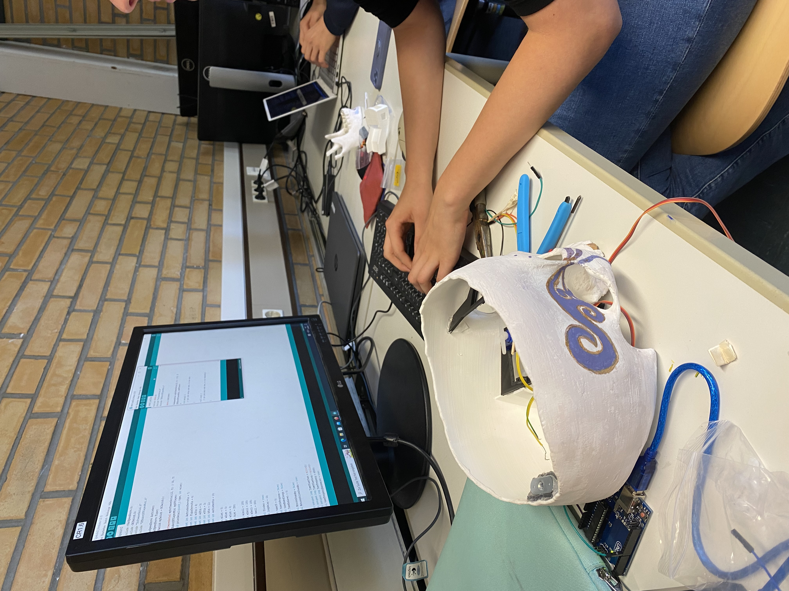
  
  </details>

   <h3>
  <bold>9. Stunde (06.10.2022)</bold> 
  
  </h3> 
Alicia beschäftigt sich damit, wie sie mit Hilfe eines Sensorwertes den DFPLayer Mini steuern kann.<br>
Rosalie sind beim Bau einige Fehler im Schaltplan aufgefallen, beispielweise fehlende Widerstände. Deshalb hat sie erneut alles auf Fehler überprüft.
  
  <h3>
  <bold>10. Stunde (24.10.2022)</bold> 
  
  </h3> 
  
 In dieser Stunde überprüfen wir die Hardware auf Fehler und sichern sie für den Transport. So werden beispielsweise Kabel mit DuckTape gesichert. Parallel werden alle zwischenteile des Codes zu einem großen Code zusammengefügt.
 Dieser ist noch unvollständig und funktioniert nicht komplett. Da Halloween vor der Tür steht entscheidet sich die Gruppe, nur einen Teil des Codes an Halloween zu benutzen.
 So kann sich der Schädel bei der Spende bedanken und hin und her gucken.


  <h3>
  <bold>11. Stunde (03.11.2022)</bold> 
  
  </h3> 
  
  Alicia ist den ganzen Code durchgegangen und hat ihn auf Fehlerquellen überprüft, da Rosalie leider krankheitsbedingt fehlen muss.
  
  
  <h3>
  <bold>12. Stunde (07.11.2022)</bold> 
  
  </h3> 
  
Der Code funktioniert nicht, weshalb eine Fehlersuche startet. Er war an einer falschen Stelle gespeichert und konnte daher nicht auf die Library zugreifen. Als der Code an der vorgesehenen Stelle gespeichert war, hat alles funktioniert.<br> 
Ein weiterer Fehler lag darin, dass die Formulierung für das Abspielen der Audiodateien falsch war. Diese Fehlermeldung konnte nach einer kurzen Internetrecherche behoben werden. Außerdem wird eine weitere Funktion, die Audiodateien betreffend, eingebaut. Diese werden, sofern kein anderer Befehl vorliegt, alle abgepielt. So muss nicht jede Audiodatei enzeln eingefügt werden.

  
  <h3>
  <bold>13. Stunde (14.11.2022)</bold> 
  
  </h3> 
  
 In dieser Stunde haben wir ohne Aufsicht gearbeitet. Alicia hat sich wieder mit dem Code beschäftigt. Relativ zum Ende der Stunde ist eine Fehlermeldung aufgetreten. Der fehlerhafte Befel soll dafür sorgen, dass der Servo zufällige Positionen, in festgelegten Grenzbereichen, ansteuert.<br>
Rosalie hat sich mit dem Aufbau der Projektseite beschäftigt. 
  

  
  <h3>
  <bold>14. Stunde (17.11.2022)</bold> 
  
  </h3> 


Alicia beschäftigt sich weiterhin mit dem Code. Die Fehlermerldung der letzten Stunde konnte gelöst werden. Eine benötigte Bibliothek war nicht installiert. Da diese allerdings auch nicht mehr verfügbar ist, muss der Befehl umgeschrieben werden.<br>
Rosalie setzt sich bei stundenanfang mit wieder mit dem GitHub Blog außeinander, bis sie Alicia bei der Fehlersuche unterstützt.

<h3>
  <bold>15. Stunde (21.11.2022)</bold> 
  
  </h3> 
Der Schädel ist nun theoretisch fertig, doch das Buch beginnt durchzuhängen, weshalb es mit Holz stabilisiert wird.<br>
  Ausserdem kann er plötzlich keine Tondateien mehr abspielen.<br> 
Nach langer Fehlersuche ist die Lösung, dass die Dateien auf der SD Karte fehlerhaft sind.
  
  
  
  <h3>
  <bold>16. & 17. & 18. Stunde (28.11.2022 & 01.12.2022 & 05.12.2022)</bold> 
  
  </h3> 
  In diesen zwei Wochen fällt der Unterricht aus und auch wir sind beide krank, weshalb jegliche Arbeit von zuhause aus stattfindet. In unserem Fall ist das vorallem die Arbeit an GitHub.
  
  
  
  <h3>
  <bold>19. Stunde (12.12.2022)</bold> 
  
  </h3>
  
  Beide arbeiten an der Projektseite. Alicia kümmert sich dabei um das einfügen der vorher von Rosalie zuhause ausgesuchten Bilder. <br>
  Rosalie überarbeitet Texte und den visuellen Aufbau der Seite.
  
  <h3>
 <bold>20.Stunde (15.12.2022)</bold>
 
 </h3>
 
 Vor der Stunde soll der Schädel an den Strom angeschlossen werden, doch das Kabel vom Netzgerät ist abgefallen. Zu Stundenbeginn wird dieses mit einem Schraubenzieher wieder an Ort und Stelle platziert. Danach wird der Schädel an den Computer angeschlossen, um den theoretisch fertigen Code zu testen, doch der Ton fehlt. <br>
Im Verlauf der Stunde wird mit dem Variieren des Codes der Fehler gesucht. Schlussendlich liegt es an dem DFPlayer, da er manchmal keine Dateien abspielt. Bei Bewegung funktioniert es teilweise, teilweise aber auch nicht. Rosalie behebt das Problem nach der Schule zuhause mit neuen Kabeln.<br>
Aufgrund einiger massiver Probleme im Code hat sie die Codestruktur noch massiv verändert. Unteranderem hat sie die Bibliothek wieder eingebaut, die Servos neu programmiert und die Dateien auf der SD-Karte neu benannt. <br>
Nun ist Karl-Leopold, pünktlich zur Abgabe, fertig. Über den restlichen Abend wird der Feinschliff der Projektseite vorgenommen.
 
 
  
  <h2 id="Code">Code</h2>
  
```C

/*
Spendenschädel Code 2022
von Alicia Gärtner und Rosalie Muchow
*/

//Bibliotheken einbinden
#include "Arduino.h" 
#include "SoftwareSerial.h"
#include "DFRobotDFPlayerMini.h"
#include <VarSpeedServo.h>

//DFPlayer konfigurieren
SoftwareSerial dfplayerserial(10, 11);
DFRobotDFPlayerMini mydfplayer;

VarSpeedServo auge1servo;  // create servo object to control a servo
// a maximum of eight servo objects can be created
VarSpeedServo auge2servo;
VarSpeedServo mundservo;

//Servos konfigurieren
const int servoPin1 = 6;  // the digital pin used for the first servo
const int servoPin2 = 7;  // the digital pin used for the second servo
const int servoPin3 = 5;  // Mund

//Pins für die Augen konfigurieren
const int Auge1 = 12;
const int Auge2 = 13;

//Variabeln für Sensorwerte definieren
int sensorValue0 = analogRead(A0);
int sensorValue1 = analogRead(A1);
unsigned long currentMillis = millis();

//Variabeln für Zeitmanagement konfigurieren
unsigned long previousMillis = 0;
unsigned long lastplay = 0;
long interval = 1000;
long audiointerval = 9000;

//Setup
void setup() {
  //LEDs als Ausgänge definieren
  pinMode(Auge1, OUTPUT);
  pinMode(Auge2, OUTPUT);
  //Kommunikation für Debugging starten
  Serial.begin(9600);
  dfplayerserial.begin(9600);

//Fehlermeldung ausgeben, wenn DFPlayer nicht eingerichtet werden kann
  if (!mydfplayer.begin(dfplayerserial)) {
    Serial.println(F("Unable to begin dfplayer!"));
    for (int a = 0; a != 100; a = a + 1) {
      digitalWrite(Auge1, HIGH);
      digitalWrite(Auge2, LOW);
      delay(100);
      digitalWrite(Auge1, LOW);
      digitalWrite(Auge2, HIGH);
      delay(100);
    }
  }
  Serial.println(F("dfplayer online"));

  mydfplayer.setTimeOut(500);

  mydfplayer.volume(30);  // 1-30

  mydfplayer.EQ(DFPLAYER_EQ_NORMAL);

  mydfplayer.outputDevice(DFPLAYER_DEVICE_SD);

//Startsound ausgeben
  //mydfplayer.play(random(1, 21));
mydfplayer.playFolder(1, 1);

  delay(5000);

//LEDs und Motoren starten
  auge1servo.attach(servoPin1);      // attaches the servo on pin 9 to the servo object
  auge1servo.write(90, 255, false);  // set the intial position of the servo, as fast as possible, run in background
  auge2servo.attach(servoPin2);      // attaches the servo on pin 9 to the servo object
  auge2servo.write(90, 255, true);   // set the intial position of the servo, as fast as possible, wait until done

  digitalWrite(Auge1, HIGH);
  digitalWrite(Auge2, HIGH);


  mundservo.attach(servoPin3);
}

void loop() {

//Fehlermeldung anzeigen, wenn die Schädeldecke fehlt
//ein nichtangeschlossener Fotosensor führt zu einer dauerhaften Beantspruchung des Dankessatzes
  while (analogRead(A0) == 0) {
    digitalWrite(Auge1, HIGH);
    digitalWrite(Auge2, HIGH);
    delay(500);
    digitalWrite(Auge1, LOW);
    digitalWrite(Auge2, LOW);
    delay(500);
  }


  //Say random Spruch
  if (random(100, 1700) == 500) {
    auge1servo.detach();
    auge2servo.detach();
    Serial.println("trigger random");

    int myRandom = random(2, 3);
    //myRandom = 1;
    Serial.print("Play Random ");
    Serial.println(myRandom);

    mydfplayer.playFolder(1, myRandom);


    auge1servo.attach(servoPin1);
    auge2servo.attach(servoPin2);

    for (int a = 0; a != 20; a = a + 1) {
      Serial.println("forSchleife");
      mundservo.write(120, random(10, 95));
      delay(random(100, 200));
      mundservo.write(180, random(10, 55));
      delay(random(100, 200));
    }
    mundservo.write(100, random(10, 25));
    delay(1000);
  }


//Aktualisiere Daten
  Serial.println("loop");
  sensorValue0 = analogRead(A0);
  sensorValue1 = analogRead(A1);
  currentMillis = millis();

//Bewege die Augen zu einer neuen Position
  if (currentMillis - previousMillis >= interval) {
    Serial.println("NewMov");
    // save the last time you blinked the LED


    int eye = random(80, 100);
    int eyeSpeed = random(1, 10);

    auge1servo.write(eye, eyeSpeed);  // move the servo to 180, fast speed, run background
    auge2servo.write(eye, eyeSpeed);  // move the servo to 180, fast speed, wait until done
    mundservo.write(random(100, 120), random(10, 30));


    previousMillis = currentMillis;
  }

//Dankessatz sagen
  if (sensorValue0 < 800 || sensorValue1 < 800) {
    Serial.print("Trigger");
    digitalWrite(Auge1, LOW);
    digitalWrite(Auge2, LOW);

//Motoren abkoppeln, da die Kommuikation mit dem DFPlayer für die Servos zu lange dauert. Sonst ruckeln sie.
    auge1servo.detach();
    auge2servo.detach();

    mydfplayer.playFolder(1, 1);

    auge1servo.attach(servoPin1);
    auge2servo.attach(servoPin2);
 
    int eye = 90;
    int eyeSpeed = 200;

    auge1servo.write(eye, eyeSpeed);
    auge2servo.write(eye, eyeSpeed);

    delay(500);
    digitalWrite(Auge1, HIGH);
    digitalWrite(Auge2, HIGH);

//Mundbewegung synchronisiert zur Audio
    mundservo.write(180, random(70, 155));
    delay(100);
    mundservo.write(100, random(10, 95));
    delay(200);
    mundservo.write(180, random(10, 55));
    delay(100);
    mundservo.write(100, random(10, 95));
    delay(200);
    mundservo.write(180, random(10, 55));
    delay(100);
    mundservo.write(100, random(10, 95));
    delay(200);
    mundservo.write(180, random(10, 55));
    delay(100);
    mundservo.write(100, random(10, 95));
    delay(200);
    mundservo.write(180, random(10, 55));
    delay(100);
    mundservo.write(100, random(10, 95));
    delay(200);
    mundservo.write(180, random(10, 55));
    delay(100);
    mundservo.write(100, random(10, 95));
    delay(500);
    mundservo.write(180, random(50, 95));
    delay(100);
    mundservo.write(100, random(10, 95));
    delay(200);
    mundservo.write(180, random(10, 55));
    delay(100);
    mundservo.write(100, random(10, 95));
    delay(200);
    mundservo.write(180, random(10, 55));
    delay(100);
    mundservo.write(120, random(10, 95));
    delay(200);
    mundservo.write(180, random(10, 55));
    delay(300);
    mundservo.write(120, random(10, 55));
    delay(200);
  }
  delay(3);
}

```
  
  <h2 id="Bau- und Schaltplan">Bau- und Schaltplan</h2>
  
Der Bau des Schädels beginnt Anfang Oktober und wird am 29.10.22 mit der Installation des Netzgerätes abgeschlossen (Ausnahme Stabilisierung Buch).<br> 
In diesem Monat wird kontinuierlich, kleinschrittig und fast ausschließlich außerhalb der Unterrichtszeit gearbeitet.<br>
  Damit ist er kein Teil des Stundenprotokolls und nicht täglich dokumentiert. Der Fortschritt kann mit kleinen Einblicken auf dem Instagramkanal des Halloweenhaus Schmalenbeck verfolgt werden.<br>
  
 <details>
  <summary>Impressionen des Baus</summary>
  
  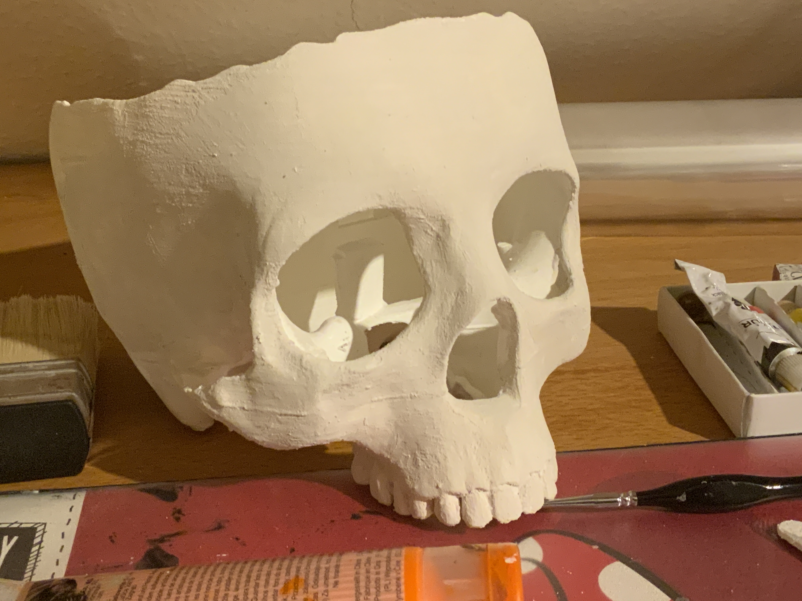
  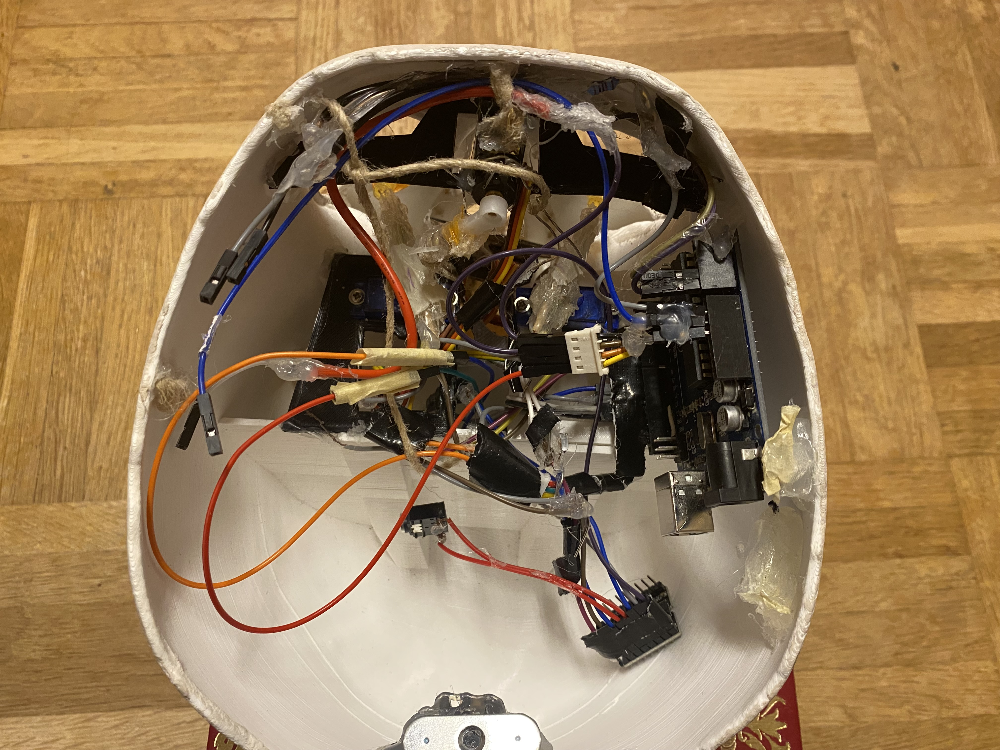
  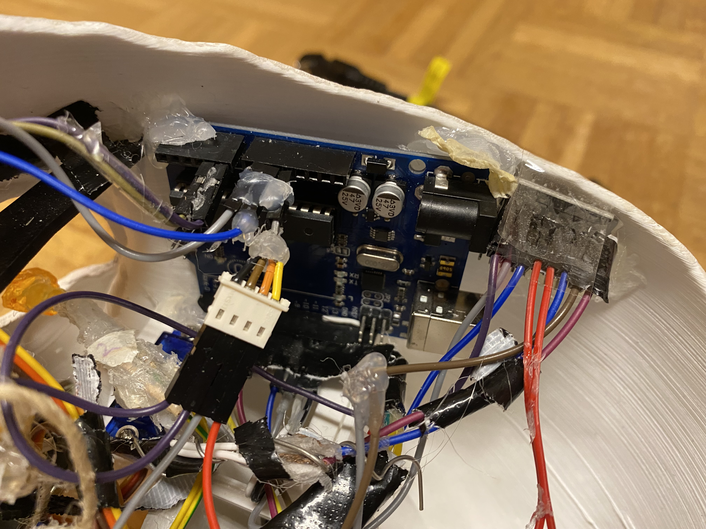
  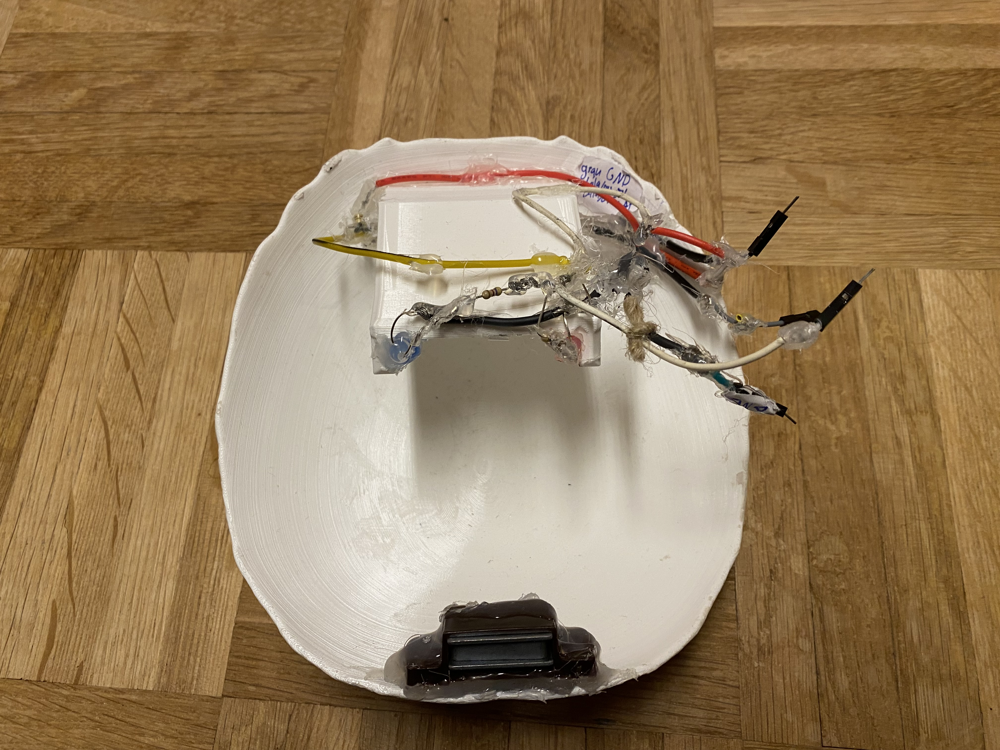
  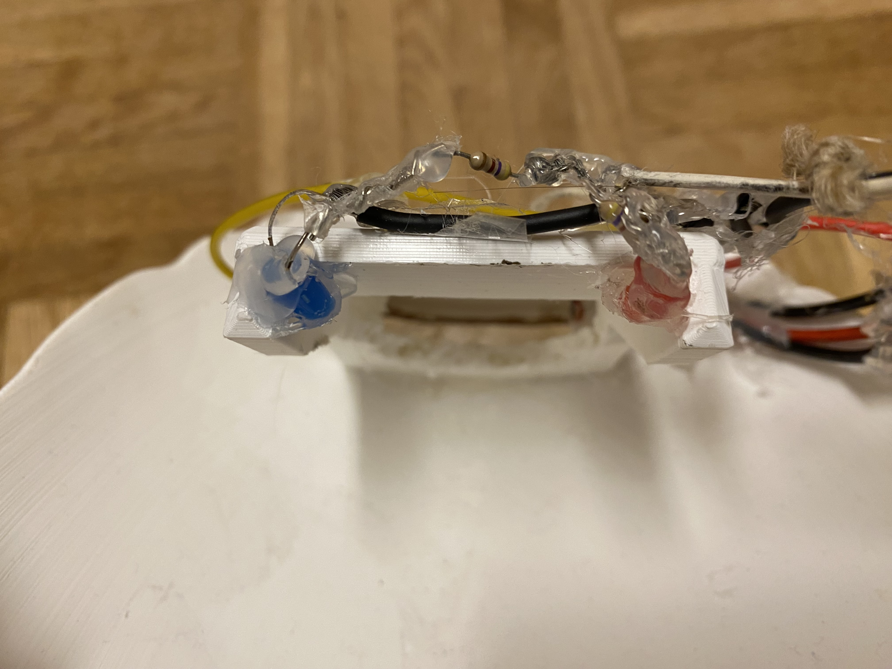
  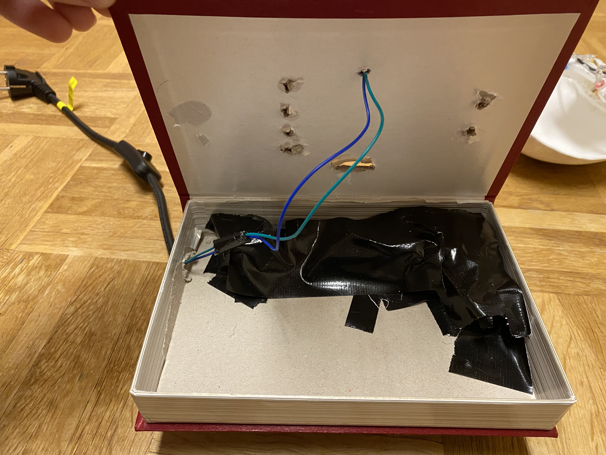
  
  </details>
  
  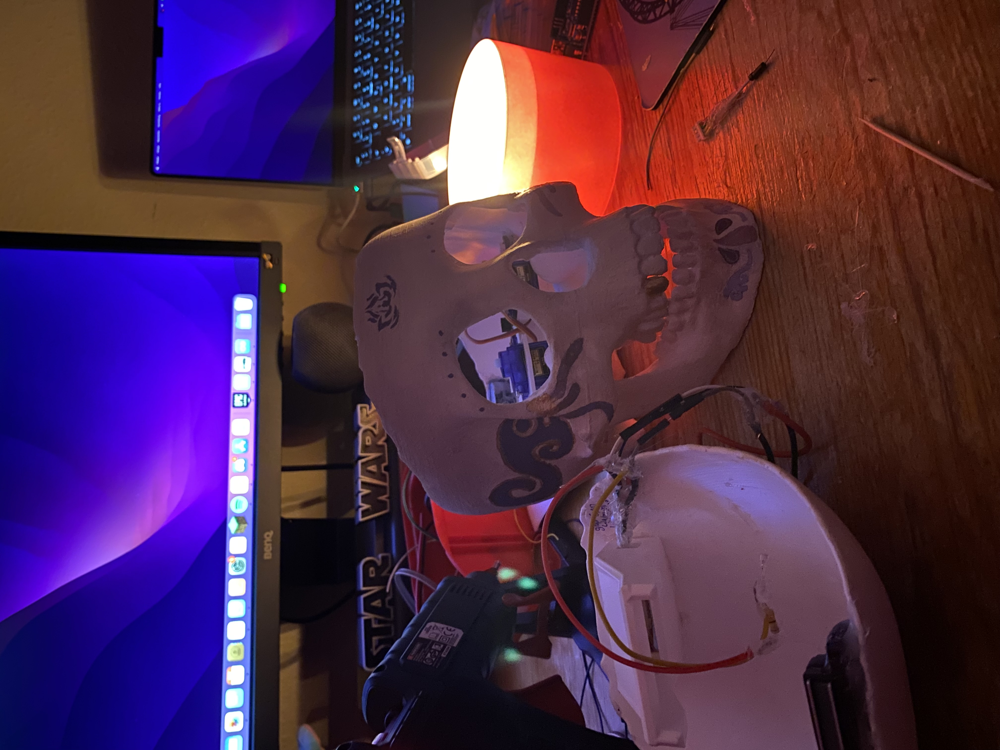
  
  Da solch ein Projekt Neuland ist, wird der Baurozess mit einfachen Bauelementen begonnen.<br>
  In diesem Fall ist das der Verbau der LEDs, da ein einfaches anschließen an den Arduino zeigt, ob alles funktioniert.<br>
  Danach wird sich mit den Servomotoren und den Fotoiderständen, später mit dem DFPlayer Mini mit dem Lautsprecher und der Stromzufuhr, beschäftigt.<br>
Der ganze Prozess läuft frei nach dem <strong>"Learning by Doing"</strong> Prinzip, da sich aus einfacher Unwissenheit, Fähigkeit, Verständnis und Wissen zu beispielweise der Bedeutung von Pins bildet. Fehler im Schaltplan erscheinen nach einer Gewsissen Zeit logisch und Verwirren nicht mehr.<br>
Der Lernprozess lässt sich gut in der Kabelordnung erkennen, da durch neues Wissen schlauere Kombinationen klar werden. Darum wird die gesamte Hardware Ende Oktober neu eingebaut, da so genug Platzt für die Geldrutsche gewährleistet werden kann.
  
Der Schaltplan zeigt neben den Verbindungen der einzelnen Elemente auch die 
Kabelfarben und die ungefähre Lage der Objekte im Schädel.<br>
Zur besseren Orientierung beim Programmieren und einfachen Kontrolle der 
korrekten Pinbelegung entsteht folgende Tabelle:

<details>
 <summary>Tabelle</summary>
 
 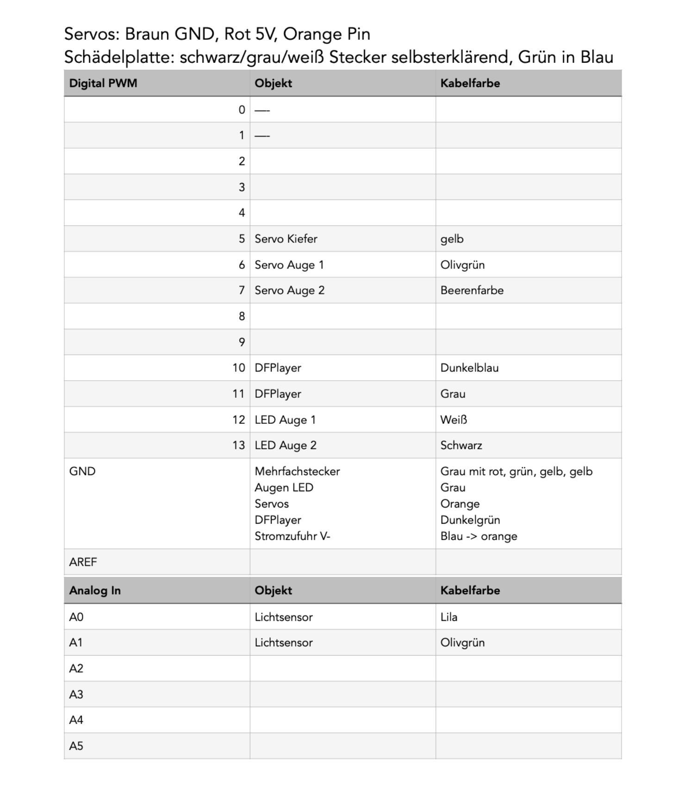
 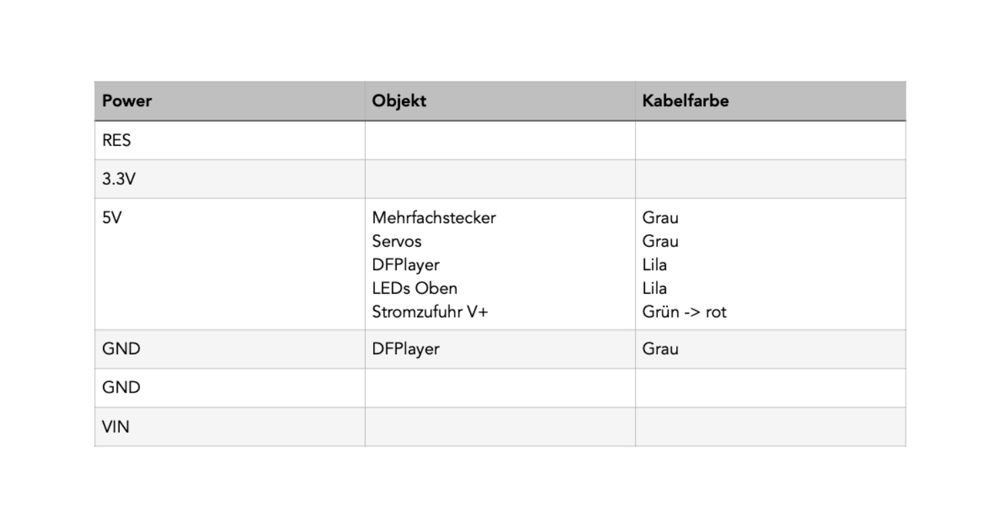
 
   </details>
  
  <h2 id="Multimediaproduktion">Multimediaproduktion</h2>
  
Ohne sein einzigartiges Auftreten wäre der Spendenschädel nichts. Um diesen Punkt zu erreichen, werden Fähigkeiten und Schritte außerhalb der Informatik gefordert.
  
Ohne die Hülle wäre Karl-Leopold niemals als Schädel zu erkennen. Ein Objekt mit unseren Anforderungen ist selbstverständlich nicht käuflich, darum wird der Kopf mit Rosalies Ender-3 max 3D-Drucker und weißem amazonbasic-Filament 3D gedruckt.<br>
  
Das 3D-Modell für wird von Freund und Teammitglied Steffen Kahl gestaltet. Mit dem Konzept und einer passenden Skizze wird aus einer kostenfreien Datei 
(https://www.thingiverse.com/thing:518109) ein optimal passendes Endprodukt geschaffen.<br>
  
Download der Dateien: http://gofile.me/6WIKw/vkNmbr4OF <br>
Passwort: Spendenschaedel3110

Bei einem gemeinsamen Treffen wird ein Design für die Schädelbemalung entworfen und umgesetzt. Auf dem mit weißer Holzpaste grundierten Schädel können Formen mit Bleistift skizziert oder auf Papier ausgedruckt und aufgeklebt werden. Bei einem letzten Schritt, dem Auftragen von Acryl und Wandfarbe, wird Karl-Leopolds Hang zur Kunst visualisiert.<br>
  Das komplementäre Farbschema harmoniert gewollt nicht mit dem Buch, um einen gruseligen Bruch im Schema zu erzeugen.
  
Die Farbe Violett symbolisiert Kreativität und das mystische, beides Kerneigenschaften des Künstlers.<br>
  Gold hingegen bildet einen Widerspruch, denn er ist nicht wohlhabend. Doch genau diesen Punkt möchte er mit der Spende ändern.<br>
  Die Perfekt Harmonie von Gleichheit und Gegensatz wird aktiv von seinem Verhalten zerstört. Dadurch kann alleine durch die Farbgebung seine teils böse und sarkastische Art und das Halloweenthema verkörpert werden. Aber natürlich auch seine harmonische, liebevolle Seite.<br>
Auf seiner Stirn prangt eine Interpretation der Lotusblume, das mythische Gewächs für Transformation. Karl-Leopold transformierte sich vom Lebenden zum Schädel ohne logische Erklärung. Diese Flüchtigkeit wird zusätzlich mit den Symbolen vom Element Luft an Schläfen und Kiefer gezeigt.<br>
 
 <details>
  <summary>Impressionen vom Wochenende</summary>
  
  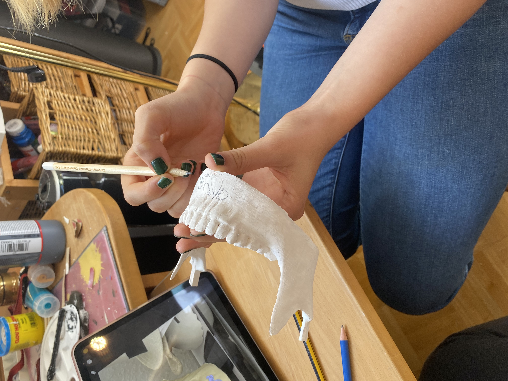
  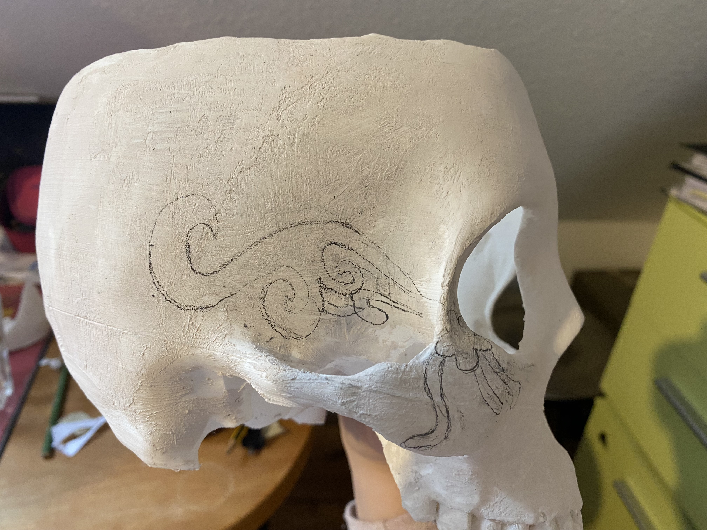

  </details>
  
Die Dabei ausgewählten Zeichen sind von der Live Action Adaptation des Romans „Grandmaster of Demonic Cultivation“ inspiriert. Für Kenner ein erster Hinweis darauf, dass eine Divergenz besteht. Die Symbole sind die Motive der Hauptclans des Protagonisten, welcher von seinem Adoptivbruder (Neunblättriger Lotus) 
verstoßen und von einem guten Freund (Fließende Wolken) neu aufgenommen wird.<br>
  
Um diese leblose Hülle zum Sprechen zu bringen, werden insgesamt 32 Sprüche geschrieben und im MuchowMedia Tonstudio aufgenommen.<br>
  Sprecher ist Freund 
und Langzeitmitglied Bennet Martins, welcher so dankenswerterweise die Aufnahme eines männlichen Sprechers ermöglichte.<br>
Die 32 Sprüche bestehen mit 21 aufgenommenen Tonspuren größtenteils aus zufälligen Sprüchen. Bedanken kann sich der Schädel mit den restlichen 11.

  <details><summary>Sprüche</summary>
  
- Nur mit deiner Spende können die Künstler weitermachen.
- Halli Hallo! Ich bin Karl-Leopold, auch Spendenschädel genannt.
- Ein kleiner Groschen oder ihr werdet verdroschen. Hehe.
- Ein kleiner Groschen für eine Brilliantbrosche. Scherz. Wisst ihr, wie teuer Lampen geworden sind?
- Ich verfluche euch zum Geldspenden.
- Ich bin ja Jahrgang 1813, und ihr wisst doch sicherlich, was 1813 noch so alles passiert ist, oder? Richtig, da gab es die Befreiungskriege. Und ich fordere euch nun dazu   auf, das Geld aus eurem Portemonnaie zu befreien.
- Hilfe, ich bin tot und brauche das Geld…
- Diesen Aufwand könnte ich im Leben nicht bezahlen! Gut, dass ich tot bin.
- Kohle Kohle Kohle, Kohle Kohle Kohle, Kohle Kohle Kohle, Scha-Bidu!
- Sag mal Bennet, ist das richtig, dass hier niemand Eintritt bezahlt? Ach ja! Ist ja auf Spendenbasis!
- Als ich klein war war glaubte ich, Geld sei das wichtigste im Leben. Heute, da ich alt bin weiß ich, es stimmt.
- Es gibt Leute, die Laufen dem Geld nach. Ich bin hier und das Geld kommt zu mir.
- Meine Sprüche sind die Kunst auf den Kopf zu zielen und die Brieftasche zu treffen.
- Mögen euch die Ärmel beim Händewaschen runterrutschen, wenn ihr kein Geld einwerft.
- Verwechsle die Höhe deiner Gage niemand mit der große deines Talents.
- Lasst Applaus in Form von Geld da.
- Herrlich erfrischend, so eine kühle Münze!
- Das einzige was mir nicht passieren kann, ist den Kopf zu verlieren.
- Ich bin die schönste Blume hier!
- Spendenschädel meldet sich zum Dienst.
- Werde ich ein Skelett, wenn ich groß bin? 
    </details>
    
  <details><summary>Dankesworte</summary>
 
- Vielen Dank holde Maid! Es ist mir eine Ehre, euch kennenzulernen.
- Oha, großer Ehrenmensch!
- Möge der große, nicht der kleine Otto. Ach was, beide mit dir sein.
- Uff, das tat weh. Obwohl ich gar keine Nerven mehr habe. Aber das ist wohl die uninterpretierbare Paradoxie meiner synthetischen Existenz.
- Mögen meine Augen euch Erleuchtung bringen!
- Danke sehr, auch das man auch nach deinem Tode gut über dich sprechen mag.
- Ich bin von deiner Begeisterung be-geist-ert. Vielen Dank!
- Vielen Dank für die Spende, ich freue mich zu Tode.
- Ich bin vom Unterkiefer bis zum Gehörknöchelchen Entzückt!
- Ich würde vor Freunde fast in die Luft springen, wenn ich denn nur könnte. Danke!
- Danke Anke, Schankedön!
    </details>
  
  <h1><bold>Evaluation</bold></h1>
  
  <h2 id="Besucherreaktionen an Halloween">Besucherreaktionen an Halloween</h2>
  
Zur Freunde des Teams hat der Schädel großes Erstaunen sowie Begeisterung im Publikum ausgelöst.<br>
  Die Menschen standen mit Faszination vor dem Projekt und haben mit Freunde gespendet. Sichtbar ist das auch an der Spendensumme pro Besucher, welche sich zum Vorjahr um 148% steigern konnte.<br>
  Damit konnte das Projekt des neuen Spendenschädels den Spendenrekord des Halloweenhaus Schmalenbeck brechen. Wie geplant konnte der lebendig wirkende und gut sichtbare Schädel die Besucher zum Spenden animieren.<br>
  Durch das helle, leuchtende Design schafft er seine eigene Ästhetik und wirkt hochwertig verarbeitet.
Glücklicherweise wurden keine Hinweise auf einen versuchten Diebstahl gefunden, ein Hinweis auf eine geglückte Diebstahlsicherung.<br>
Trotz Hochskalierung der Größe musste der Kopf an Halloween geleert werden, weshalb in Zukunft ein Loch zwischen Schädelboden und Buch entstehen soll.
  
  <h2 id="Technische Evaluation">Technische Evaluation</h2>
  
Aus technischer Sicht ist das Team zufrieden mit dem Ergebnis, da das Projekt zuverlässig und nach Wunsch funktioniert. 

Das erste technisch zu behebende Problem ist die ungenaue Bewegung des Kiefers. Der Effekt lässt sich mit auf die Tondateien angepasste Anweisungen beheben.
  
Die Idee, einen Lautsprecher einzubauen, kann auch als erfolgreich betrachtet werden. Jedoch ist die Tonqualität sehr schlecht, weshalb die Idee nach einem neuen Lautsprecher an einer vielleicht anderen Position besteht.
  
Ein wiederkehrendes Problem ist der Geldstau, welcher durch einen zu kleinen Winkel in der Geldrutsche verursacht wird. Das Problem konnte mithilfe eines Dremel schon deutlich verbessert werden.
  
Mit der beim Bau gesammelten Erfahrung wissen wir, wie wir den Innenraum noch effizienter hätten gestalten können. Der Kabelsalat im Kopf hätte mit anderem Kabelmanagement Platzsparender sein können. Auch die Verbindung zwischen Kopf und Schädeldecke hatte einfacher gestaltet werden können.
  
  <h2 id="Persönliches Wachstum">Persönliches Wachstum</h2>
  
Als Ersteller können wir, Alicia und Rosalie, den Spendenschädel als persönlichen Erfolg und ersten Weg in die Informatik sehen. Das Realisieren des ganzen Projektes hat unglaublich viel Spaß gemacht und uns gezeigt, wie einfach das eigentlich geht.<br>
Das Projekt war eine Art Spielwiese, auf der wir viel gelernt und ausprobiert haben, weshalb wir von unseren Erkenntnissen in Zukunft profitieren.<br>
Ein sehr bestätigendes Gefühl war auch, das Vorwissen aus dem Physikunterricht einbringen zu können.
  
  <h1 id="quellen"><bold>Quellen und Eigenständigkeitserklärung</bold></h1>
  
<details><summary>Code</summary>
- https://www.youtube.com/watch?v=GnGv21v7h8s<br>
- https://blog.robberg.net/wp-content/uploads/2017/10/DFPlayer.jpg<br>
- https://wolles-elektronikkiste.de/wp-content/uploads/2019/07/UNO_2.jpg<br>
- https://www.arduino.cc/en/Tutorial/BuiltInExamples/Blink<br>
- https://www.youtube.com/watch?v=cYOft1rEBYw<br>
- https://starthardware.org/dfplayer-mini-mp3-player-fuer-arduino/<br>
- https://www.arduino.cc/reference/en/language/functions/communication/serial/println/<br>
- http://www.gammon.com.au/interrupts<br>
- https://wolles-elektronikkiste.de/dfplayer-mini-ansteuerung-mit-dem-arduino<br>
- https://ardurobot.jimdofree.com/lehrgang/posten-12-lichtsensor/<br>
- https://starthardware.org/dfplayer-mini-mp3-player-fuer-arduino/<br>
- https://docplayer.org/176475379-Mp3-player-mit-dfplayer-mini.html<br>
- https://www.theamplituhedron.com/articles/How-to-use-DFRobot-DFPlayer-Mini-Serial-MP3-Player-with-Arduino/<br>
- https://starthardware.org/arduino-programmieren/<br>
- https://starthardware.org/arduino-programmieren/<br>
- https://www.youtube.com/watch?v=2tE_1RSmXkQ<br>
- https://www.delphipraxis.net/122145-code-strukturieren-wie-macht-man-es-richtig.html<br>
- https://studyflix.de/informatik/pseudo-code-und-struktogramme-830<br>

 </details>
 
  
<details><summary>Schaltplan</summary>
- https://cdn-reichelt.de/bilder/web/xxl_ws/B300/ARDUINO_UNO_A06.png<br>
- https://www.makerelectronico.com/wp-content/uploads/2017/06/DFplayer-minireproductor-mp3-3-1.jpg<br>
- https://circuitjournal.com/how-to-use-the-dfplayer-mini-mp3-module-with-an-arduino<br>
- https://maker.pro/arduino/projects/how-to-use-the-dfmini-player-mp3-module-with-arduino<br>
- https://starthardware.org/en/dfplayer-mini-mp3-player-for-arduino/<br>
- https://www.youtube.com/watch?v=P42ICrgAtS4<br>
- https://learn.sparkfun.com/tutorials/basic-servo-control-for-beginners/all<br>
- https://nerdytechy.com/how-to-connect-led-to-arduino/<br>
 
</details>
 
  <details><summary>GitHub</summary>
- https://github.com/simonrettmann/Projektseite<br>
- https://github.com/simonrettmann/Stundenprotokolle<br>
- https://docs.github.com/en/get-started/writing-on-github/getting-started-with-writing-and-formatting-on-github/basic-writing-and-formatting-syntax<br>
- https://de.wikihow.com/Mit-HTML-fett-gedruckten-Text-erzeugen<br>
- https://www.youtube.com/watch?v=_PXR34xtpSw<br>

</details>
  
<details><summary>Gamification</summary>
- https://wirtschaftslexikon.gabler.de/definition/gamification-53874<br>
- https://de.wikipedia.org/w/index.php?title=Gamification&oldid=227708425<br>

</details>
  
<details><summary>Wahl der Hardware</summary>
  - https://store.arduino.cc/products/arduino-uno-rev3/<br>
  - https://de.wikipedia.org/wiki/Servomotor<br>
  - https://de.wikipedia.org/wiki/Leuchtdiode<br>
  - https://de.wikipedia.org/wiki/Fotowiderstand<br>
  - https://www.mymakerstuff.de/2016/04/06/arduino-tutorial-der-lichtsensor/<br>
  - https://starthardware.org/dfplayer-mini-mp3-player-fuer-arduino/<br>
  - https://www.dfrobot.com/product-1121.html<br>
  - https://de.wikipedia.org/wiki/Lautsprecher<br>
  - https://de.wikipedia.org/wiki/Logic_Pro<br>
  - https://www.conrad.de/de/ratgeber/entwicklungskits-bausaetze/arduino.html#aufbau<br>
 - https://de.wikipedia.org/w/index.php?title=Scharnier&oldid=228795079

</details>
  
<details><summary>Software</summary>
  - https://docs.arduino.cc/learn/starting-guide/the-arduino-software-ide<br>
  - https://kinsta.com/de/wissensdatenbank/was-ist-github/<br>
  - https://docs.arduino.cc/software/ide-v1/tutorials/arduino-ide-v1-basics<br>
  - https://www.arduino.cc/en/Guide<br>
  - https://docs.arduino.cc/software/ide-v1/tutorials/arduino-ide-v1-basics<br>
  </details>
 
<details><summary>Persönlichkeit</summary>
  - https://pixars-coco.fandom.com/wiki/H%C3%A9ctor_Rivera<br>
  - https://www.viversum.de/online-magazin/lotusblume-bedeutung<br>
  - https://player.hu/uploads/2017/11/coco-hector.jpg<br>
  - https://de.wikipedia.org/w/index.php?title=1813&oldid=223921932
  
  </details>
  
<details><summary>Halloweenhaus Schmalenbeck</summary>
  - https://www.halloweenhaus-schmalenbeck.de/<br>
  - https://www.sat1regional.de/grusel-und-schrecken-im-halloween-haus-schmalenbeck-in-grosshansdorf/

</details>
  
<details><summary>Multimediaproduktion</summary>
  - https://ais.badische-zeitung.de/piece/0a/5f/36/1e/174011934-h-720.jpg<br>
  - https://modao-zushi.fandom.com/wiki/Yunmeng_Jiang_Clan<br>
  - https://modao-zushi.fandom.com/wiki/Gusu_Lan_Clan<br>
 
 </details>
 
<details><summary>Eigenständigkeitserklärung</summary>
  - https://www.ats.uni-muenchen.de/studium_lehre/material/eigenstaendigkeit/erklaerung_pdf.pdf<br>

</details>
  
Alle Quellen wurden erfolgreich am 16.Dezember 2022 um 01.38 Uhr abgerufen.
  
Hiermit bestätigen wir, Alicia Gärtner & Rosalie Muchow, dass wir die vorliegende Arbeit selbstständig verfasst und keine anderen als die angegebenen Hilfsmittel benutzt haben. Die Stellen der Arbeit, die dem Wortlaut oder dem Sinn nach anderen Werken (dazu zählen auch Internetquellen) entnommen sind, wurden unter Angabe der Quelle kenntlich gemacht.


<h3><a href="#oben">Zurück zur Navigation</a></h3>
