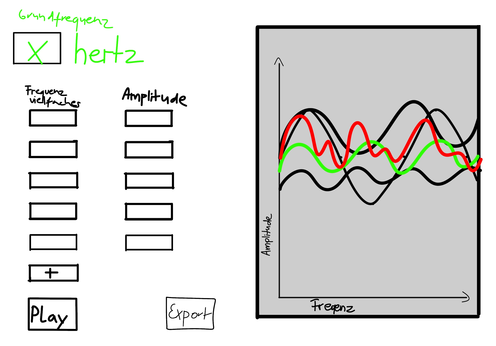

<h1>
  <bold>1. Stunde (22.08.2022)</bold>
  
  </h1>
  
Zusammen erstellten wir unsere GitHub Accounts, sowie unsere Projektseite. Anschließend haben wir uns über ein mögliches Projekt gedanken gemacht. Unsere erste Idee war es, eine beleuchtete Stadt zu konstruieren, dessen LEDs über ein LCD Display einzeln ansteuerbar sind. Zusätzlich sollen mit einprogrammierten Routinen kleine Lichtshows möglich gemacht werden. Das Projekt soll selbstständig Tag und Nacht unterscheiden und die Routinen demensprechend anpassen.
Da das Projekt so zu wenig Programierung erfordert wurde der Plan verworfen.
Unser aktueller Plan sieht vor, dass wir einen Soundwavegenerator programieren. Dieser soll ein aus der Grundfrequenz und selbst eingegebenen Obertönen Töne generieren. Selbstverständlich sollen diese Töne auch exportiert werden können.

  
Skizze

  
  
  
  

 
<h1>
  <bold>2. Stunde (25.08.2022)</bold> 
  
  </h1>

  
Die letzten Tage habe wir festgestellt, dass wir mit dem Projekt einen Soundwavegeneratror zu programieren nicht glücklich sind. Jedoch sind wir uns einig, dass uns Physical Computing und damit die Arbeit mit einem Arduino interessiert. Wir haben uns zuhause mit den Möglichkeiten, Programmen und Hardware  auseinandergesetzt und im Unterricht besprochen. Dabei kam uns unsere Projektidee:

Das Halloweenhaus Schmalenbeck (www.halloweenhaus-schmalenbeck.de) nutzt traditionell einen Spendenschädel (Spendendose in Schädelform). Dieser billige Plastikschädel mit Münzloch ist relativ klein und unsauber verarbeitet.  Das ist für uns die Gelegenheit, einen neuen zu Gestalten. Inspiriert von den Mülleimern im niederländischen Freizeitpark Efteling haben wir ein Konzept erarbeitet.

  
Konzept

  
- Schädel, der sprechen kann (motorisierter Kiefer mit Servo)
- Soundkarte und Lautsprechern (DFPlayer Mini)
- euchtende Augen, welche in verschiedene Richtungen schauen können (LEDs, Servos)
- Sensor für Geld (Lichtschranke)
- arbeiten mit Arduiono (Arduiono IDE)

  
Features

  
- Schädel fragt nach Spenden (Audio synchron mit Kiefer)
- Bei Geldeinwurf bedankt sich der Schädel
- Mute Schalter

  
Optional
 
  
- Diebstahlschutz

  

Anschließend haben wir wir Rücksprache mit Herrn Buhl. Dieser gab uns den Tipp, eine Prioritätenliste anzulegen, denn so können wir jederzeit bei Zeitdruck aufhören. 

  
Prioritätenliste

  
- Lautsprecher -> um nach Spenden zu fragen -> Aufnahmen stellt das Halloweenhaus Schmalenbeck
- Bewegung im Kiefer
- Erkennung des Münzeinwurfs -> Schädel bedankt sich
- leuchtende Augen
- Mute Schalter
- sich bewegende leuchtende Augen
- Diebstahlschutz

<h1>
  <bold>3. Stunde (29.08.2022)</bold> 
  
  </h1>
  
  
Über das Wochenende haben wir einen Ordner auf Rosalies NAS erstellt, um dort sicher und einfach Daten zu sichern und teilen. Außerdem hat Rosalie das Lager des Halloweenhaus Schmalenbeck nach Hardware gesichtet und LEDs, einen Az-Delivery Mini MP3 Player DFPlayer Master Module für Arduino und einen AZ-Delivery Fotowiderstand (Photo Resistor) Dioden 150V 5mm LDR5528 GL5528 5528 50pcs für unser Projekt genommen.
Da Alicia in dieser Stunde leider fehlte, hat Rosalie alleine angefangen, einen Schaltplan zu erstellen. Der Sinn dabei ist, Fehlbauten zu verhindern und schonmal eine Vorstellung von benötigten Kabeln, Wiederständen usw zu bekommen. In der Stunde kamen netterweise schon erste Hinweise von Klassenkameraden, beispielsweise der benötigte Wiederstand an den LEDs.

  
Quellen

  
 - https://www.youtube.com/watch?v=GnGv21v7h8s
 - https://blog.robberg.net/wp-content/uploads/2017/10/DFPlayer.jpg
 - https://wolles-elektronikkiste.de/wp-content/uploads/2019/07/UNO_2.jpg
 - https://www.arduino.cc/en/Tutorial/BuiltInExamples/Blink
 - https://www.youtube.com/watch?v=cYOft1rEBYw
 - https://de.wikipedia.org/wiki/Fotowiderstand
  

 
 
 <h1>
  <bold>4. Stunde (05.09.2022)</bold> 
  
  </h1>
  
  In dieser Stunde haben wir den noch Fehlenden Fotowiederstand in die Skizze aufgenommen und diese auf Fehler überprüft. Dank einiger Tipps konnten wir 
  diese finalisieren.

  
Danach haben wir mit dem programmieren unseres Codes angefangen, welcher eine LED zum leuchten bringen soll. Anschließend haben wir unsere LED mit dem Arduino und diesen wiederrum mit dem Computer verbunden. Dies hat dann auch funktioniert. Als wir es erneut probierten klappte es leider nicht mehr. Der Fehler lag bei den losen Kabeln, welche keine Verbindung mehr herstellten. Bisher konnten wir das Problem noch nicht lösen und haben ums erstmal wieder dem Code zugewendet.

  
Quellen

  
- https://www.c-sharpcorner.com/UploadFile/d15fb8/ldr-with-arduino/Images/LDR.jpg
 

<h1>
  <bold>5. Stunde (08.09.2022)</bold>
     </h1>
  
In dieser Stunde haben wir uns mit einem Servo beschäftigt. Wir haben gelernt, wie man mithilfe eines Arduinos den Servo steuern kann und ein programm dazu geschrieben.
 
Außerdem haben wir uns mit dem Schädel befasst und sein Aussehen, sowie seinen Charakter festgelegt. Dieser Charakter legt auch die Sprechweise des spendenschädels fest. Wir haben uns darauf geeinigt, dass der Schädel männlich, lustig und schlau ist. Sein Name lautet Karl Leopold.

 
 
 <h1>
  <bold>6. Stunde (12.09.2022)</bold>
     </h1>
     
     
Heute haben wir uns näher mit dem Charakter und dem Hintergrund des Spendenschädels beschäftigt. Inspiration erhielten wir von der Figur Héctor Rivera aus dem Film "Coco". 
Karl leopold wurde 1813 geboren und war sein lebenlang ein armer, deutscher Künstler. Da er kaum Geld hatte nutzte er sein Gesicht als Leinwand. Sein Leben endete tragischerweise bei der Ausübung seiner Leidenschaft, da er sich giftige Farbe auf sein Gesicht auftug.
Ebenfalls haben wir die Sprüche festgelget, die der Spendenschädel sagen soll. In Klammern dahinter steht jeweils die Art, wie der Satz gesprochen werden soll.

 

Allgemeine Sprüche

- Nur mit deiner Spende können die Künstler weitermachen. (animierend)
- Halli, hallo! Ich bin Karl Leopold, auch Spendenschädel genannt. (glücklich, aufgeweckt)
- Ein kleiner Groschen oder ihr werdet verdroschen, hehe. (frech)
- Ein kleiner Groschen für eine Brilliantbrosche. (ernst, fröhlich) Scherz. Wisst ihr, wie teuer Lampen geworden sind? (scherzhaft)
- Ich verfluche euch zum Geld spenden. (ironisch)
- Rosi, dein ökologischer Fußabdruck ist eine Pfote. (ernst)
- Fantasie ist, dass Sie sich buntgespränkelte zebras vorstellen. (ernst, fröhlich)
- Ich bin ja Jahrgang 1813. Und ihr wisst doch sicherlich, was 1813 noch so alles passiert ist, oder? Richtig, da gab es die Befreiungskriege. Und ich         fordere euch nun dazu auf, euer Geld aus eurem Portemonaie zu befreien.
- Hilfe ich bin tot und brauche das geld

Danksagungen

  
- Vielen Dank Ihr holde Maid. Es ist mir eine ehre euch kennenzulernen. Ich hoffe Ihr sterbt bald. (zu tiefst berührt)
- Oha, großer Ehrenmensch! (beGEIStert)
- Möge der große, nicht der kleine Otto, ach was beide, mit dir sein. (dankend, fröhlich)
- Uff, das tat weh, obwohl ich gar keine Nerven mehr habe. Aber das ist wohl die uninterpretierbare Parodaxie meinersynthetischen Existenz. (nachdenklich)
  programm für kiefer geschriben
  kiefer auf sprüche anpassen festgelegt
- Oha, ich möchte aufrichtig danken, mögest du immer Chicken Nuggets im Haus haben! (ernst)
- Mögen meine Augen Euch erleutung bringen! (feierlich)
- Ich hab Geld im Kopf bin bei der FDP,
doch trozudem sage ich dir jetzt DANKEE

Außerdem wir das Programm für die Kieferbewegung geschrieben. Hier tauchte zunächst ein Fehler bei dem Uploud auf den Arduiono auf. Dieses konnte allerdings durch einen anderen Code gelöst werden. Dieser code wurde danach nicht wieder benötigt und taucht daher auch nicht in dem finalen Code auf.

  
Quellen

  
- https://player.hu/uploads/2017/11/coco-hector.jpg
       

<h1>
  <bold>Wochenende (17&18.09.2022)</bold>
     </h1>
Am Samstag hat Rosalie den Spendenschädel mit einer weißen Holzpaste grundiert, damit der Schädel keine Kanten hat, die durch den 3D-Druck entstehen. Anschließend hat sie den SChädel mit weißer Acrylfarbe angemalt.  
Am Sonntag haben wir uns getroffen und zuerst eine Skizze angefertigt, wie der Schädel aussehen soll. Anschließend haben wir uns auf ein Farbschema geeinigt und mit einem Bleistift, die Formen vorgezeichnet. Der letzte Schritt bestand darin, den Schädel anzumalen.
   
   
<h1>
  <bold>7.Stunde (19.09.2022)</bold>
  </h1>
  
Wir haben weitere Sprüche entwickelt, welche in der Liste der letzten Stunde aufgeführt sind. Außerdem haben wir unsere Code-Struktur ausgefeilt, da diese noch einige Fehleraufwies und noch nicht vollständig war.

  
Quellen
 

- https://funduino.de/nr-6-fotowiderstand
- https://starthardware.org/dfplayer-mini-mp3-player-fuer-arduino/
- https://www.arduino.cc/reference/en/language/functions/communication/serial/println/
- http://www.gammon.com.au/interrupts

  

 

   <h1>
  <bold>8. Stunde (06.10.2022)</bold> 
  
  </h1> 
Alicia beschäftigt sich damit, wie sie mit Hilfe eines Sensorwertes die Audiodateien steuern kann. Sobald Geld eingeworfen wird soll der Spendenschädel nämlich nicht mehr seine normalen Sprüche aufsagen sondern sich bedanken.
Rosalie setzt sich weiterhin mit der Hardware auseinander und erstellt einen Schaltplan mit Fritzing. 
  
  

    
Quellen

      
  - https://wolles-elektronikkiste.de/dfplayer-mini-ansteuerung-mit-dem-arduino
  - https://ardurobot.jimdofree.com/lehrgang/posten-12-lichtsensor/
  
  

  
  <h1>
  <bold>9. Stunde (24.10.2022)</bold> 
  
  </h1> 
  
  Rosalie hat die Hardware überprüft und Alicia hat am Code weitergearbeitet.
  

  
Quellen

- https://starthardware.org/dfplayer-mini-mp3-player-fuer-arduino/
- https://docplayer.org/176475379-Mp3-player-mit-dfplayer-mini.html

 

  <h1>
  <bold>10. Stunde (03.11.2022)</bold> 
  
  </h1> 
  
  Alicia ist den Code durchgegangen und hat ihn auch Fehlerquellen überprüft.
  
  
  <h1>
  <bold>11. Stunde (07.11.2022)</bold> 
  
  </h1> 
  
Alicia hat erneut den Code auf Fehlerquellen überprüft. Der Code war an einer falschen Stelle gespeichert und konnte daher nicht auf die Librarie zugreifen. Als der Code an der vorgesehenen Stelle gespeichert war, hat alles funktioniert. Ein weiterer Fehler lag darin, dass die Formulierung für das Abspielen der Audiodateien falsch war. Diese Fehlermeldung konnte nach einer kurzen Internetrecherche behoben werden. Alicia hat außerdem eine weitere Funktion, die Audiodateien betreffend, eingebaut. Diese werden, sofern kein anderer Befehl vorliegt, alle abgepielt. So muss nicht jede Audiodatei enzeln eingefügt werden.
Außerdem hat sie mit HTML den Blog weiter strukturiert.
 
 
 

  
Quellen

  
 - https://www.theamplituhedron.com/articles/How-to-use-DFRobot-DFPlayer-Mini-Serial-MP3-Player-with-Arduino/
  
 

  
  <h1>
  <bold>12. Stunde (14.11.2022)</bold> 
  
  </h1> 
  

  
  <h1>
  <bold>13. Stunde (17.11.2022)</bold> 
  
  </h1> 
